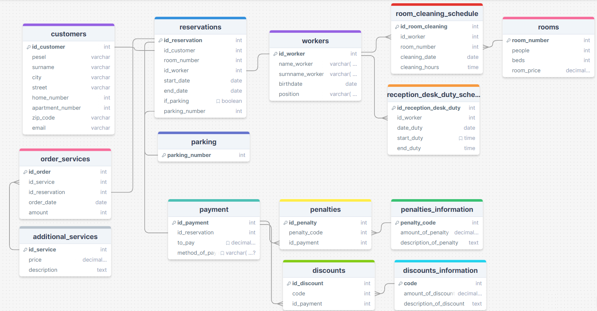

## hotel_database
Database and basic UI for a hotel service. Hotel database that serves to better organize the work of the hotel.

**Relational diagram**

### Project details

PostgreSQL server was used to create our database. Code for creation of tables, constraints and views is in the file  _hotel_tables.sql_. File _hotel_functions.sql_ create functions and triggers for tables. Example data for the database can be added by running the file _hotel_inserts.sql_.

The connection was done by connecting to database local host. 

### Interface

## Description of hotel service database
Project presents a hotel database that serves to better organize the work of the hotel. It contains the information necessary  
for easy and fast customer service. We can also get from it  
information about the organization of the hotel employees' work.

The database consists of 14 tables linked by various relations,  
9 views, 8 functions/triggers.

In particular, it allows access to information on:

- details of the reservation(customer, date of stay, employee handling the reservation, number of the reservation.  
handling a particular reservation, room number, information on the use of parking). 
- personal data of clients using the hotel's services
- payment details for each reservation (including fees for  
for additional services, discounts and possible fees for damages caused)  
for damages caused)
- services offered by the hotel
- the possibility of obtaining discounts and penalties
- availability of specific rooms in the specified time period
- numbers of reservations starting and ending in the specified time period availability of parking
- schedule of employees

Assumptions of database: 
- customers can use any number of services
- payment can be made with the amount divided in several ways 
- payment is made at the end of the stay 
